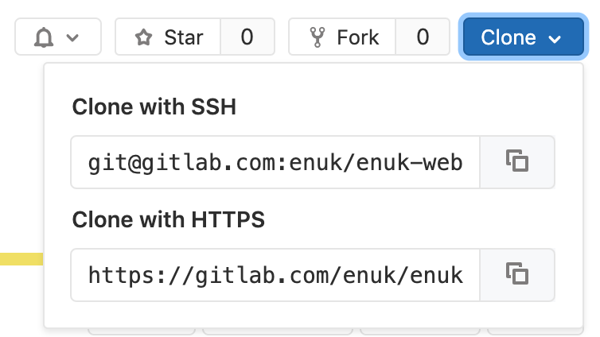
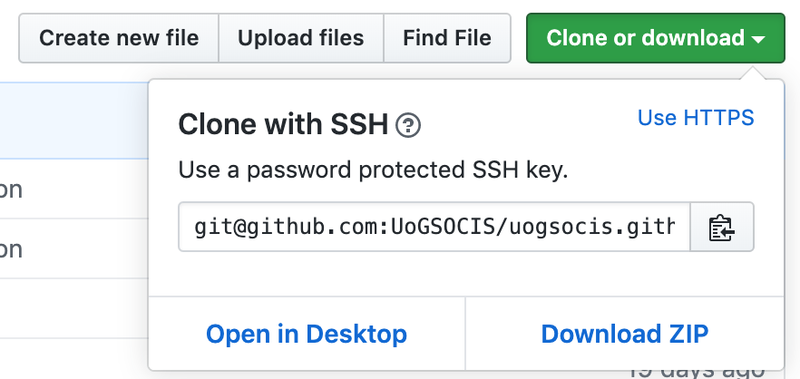

# Create an ssh keypair


```bash
$ ssh-keygen
Generating public/private rsa key pair.
Enter file in which to save the key (/home/pi/.ssh/id_rsa):
Enter passphrase (empty for no passphrase):
Enter same passphrase again:
Your identification has been saved in /home/pi/.ssh/id_rsa.
Your public key has been saved in /home/pi/.ssh/id_rsa.pub.
The key fingerprint is:
SHA256:hwlndIFyRTwcz8wKnADSCak0+2kvAzuPQ+8zzUXSK0E pi@hades
The key's randomart image is:
+---[RSA 2048]----+
|  o+.o. .**o     |
| o..oE.+oo+=     |
|..o . oo*  .=    |
|..   o * + .     |
|  . . + S o      |
| o + . o .       |
|. = + o          |
| +.* +           |
| .=o=            |
+----[SHA256]-----+
```


This will create a the private key `~/.ssh/id_rsa` and the public key `~/.ssh/id_rsa.pub`. Make sure that private key stays secret and do not share it with anyone.

To add your private key to your keychain run the following command and enter the password that you set in the previous stage.

```bash
$ ssh-add ~/.ssh/id_rsa
```

### Adding the public key to github / gitlab


Now that you have created the keys you can copy the public key and put it on github or gitlab.

```bash
$ cat ~/.ssh/id_rsa.pub
```

Copy the output of the command

#### on Github go to

settings > ssh and gpg keys > new ssh key


#### on Gitlab go to

settings > ssh keys


## Using the SSH keys

Instead of being prompted to enter the username and password every time that you use the HTTPS links to `push`, `pull` or `clone` a repository.

All you have to do to not be prompted to use


{width=50%}
{width=50%}